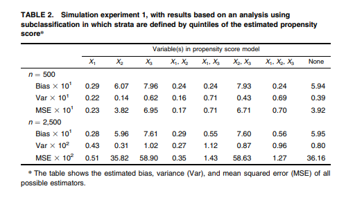
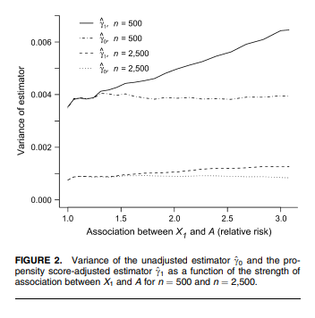

<!-- This is the format for text comments that will be ignored during renderings. Do not put R code in these comments because it will not be ignored. -->
<!-- The following code chunk defines some general settings how code chunks should behave. -->

```{r setup, echo = FALSE}
knitr::opts_chunk$set(
	echo = FALSE,
	fig.path = "../figures/",
	message = FALSE,
	warning = FALSE,
	collapse = TRUE,
	comment = "#>",
	dpi = 300
)
devtools::load_all()
```

<!-- The actual document text starts here: -->

\section*{General reflection on the replication process}
Descriptions of the simulation methods were generally very clear, making it relatively easy to replicate the simulations. In particular when formulas were provided, it was easy to understand what procedure was intended. The figure showing the data-generating mechanism was helpful, although the associations $\alpha_0$ - $\alpha_4$ and $\beta_0$ - $\beta_3$ were not depicted. Specific software implementations were not described clearly, but this did not hamper replicability of results. For example, no packages in R were referenced for estimation of the splines or c-statistic (which makes sense given the year of publication).Results of the replication are presented below.

\section*{Considerations and curiosities}

\begin{itemize}
    \item When results are different from the original paper, when should one stop explore modifications of the code in order to reproduce the original values?
    \item To what extent are results replicable (at all), when they are only presented as a graphic?
\end{itemize}

\newpage
\section*{Replication results}

\subsection*{Table 1}

Copied from original manuscript:

```{r echo=FALSE, out.width = "200%"}
knitr::include_graphics('../figures/Table1.png')
```

Found in replication:


```{r}
# Source helper scripts
source("../simulation/scenarios.R")
source("../simulation/tables.R")

# Make sure to use correct values for important parameters
alpha4 <- 0.5

# Functions that produce tables as in original manuscript (latex format)

#create_table1()

```
% latex table generated in R 3.6.3 by xtable 1.8-4 package
% Fri Sep 11 16:20:27 2020
\begin{table}[ht]
\centering
\begin{tabular}{rrrrrrrrr}
  \hline
  & \multicolumn{8}{c}{Variable(s) in propensity score model} \\
 & X1 & X1+X2 & X1+X2+X3 & X1+X3 & X2 & X2+X3 & X3 & None \\
 \hline
n = 500 &  &  &  &  &  &  &  &  \\ 
  Bias x 10 & 0.07 & 0.08 & 0.03 & -0.00 & 5.94 & 7.37 & 7.35 & 5.99 \\ 
  Variance x 10 & 0.30 & 0.21 & 0.33 & 0.44 & 0.24 & 0.40 & 0.49 & 2.78 \\ 
  MSE x 10 & 0.30 & 0.22 & 0.33 & 0.44 & 3.78 & 5.82 & 5.88 & 3.98 \\ 
  Average c-statistic & 0.67 & 0.67 & 0.82 & 0.82 & 0.52 & 0.76 & 0.76 &  \\ 
  n = 2,500 &  &  &  &  &  &  &  &  \\ 
  Bias x 100 & -0.02 & -0.10 & -0.07 & -0.01 & 59.25 & 73.37 & 73.42 & 59.17 \\ 
  Variance x 100 & 0.68 & 0.51 & 0.72 & 0.90 & 0.59 & 0.87 & 1.05 & 6.32 \\ 
  MSE x 100 & 0.68 & 0.51 & 0.72 & 0.90 & 35.70 & 54.71 & 54.95 & 35.91 \\ 
  Average cstatistic & 0.67 & 0.67 & 0.81 & 0.81 & 0.51 & 0.76 & 0.76 &  \\ 
   \hline
\end{tabular}
\end{table}

\newpage

\subsection*{Table 2}

Copied from original manuscript:
```{r echo=FALSE, out.width='1000%'}

```

Found in replication:
% latex table generated in R 3.6.3 by xtable 1.8-4 package
% Wed Aug 26 13:50:44 2020
\begin{table}[ht]
\centering
\begin{tabular}{rrrrrrrrr}
  \hline
  & \multicolumn{8}{c}{Variable(s) in propensity score model} \\
 & X1 & X2 & X3 & X1+X2 & X1+X3 & X2+X3 & X1+X2+X3 & None \\
 \hline
n = 500 &  &  &  &  &  &  &  &  \\ 
  Bias x 10 & -0.02 & -3.76 & -4.78 & -0.02 & 0.08 & -4.76 & 0.10 & -3.72 \\ 
  Variance x 10 & 0.24 & 0.18 & 0.46 & 0.17 & 1.42 & 0.23 & 1.22 & 1.85 \\ 
  MSE x 10 & 0.24 & 1.59 & 2.74 & 0.17 & 1.42 & 2.50 & 1.22 & 1.65 \\ 
  n = 2,500 &  &  &  &  &  &  &  &  \\ 
  Bias x 10 & -0.15 & -3.76 & -4.71 & -0.16 & -0.39 & -4.71 & -0.40 & -3.75 \\ 
  Variance x 100 & 0.49 & 0.33 & 0.68 & 0.33 & 0.82 & 0.50 & 0.60 & 3.85 \\ 
  MSE x 100 & 0.51 & 14.49 & 22.84 & 0.35 & 0.98 & 22.71 & 0.76 & 14.58 \\ 
   \hline
\end{tabular}
\end{table}

\newpage

\subsection*{Table 3}
etcetera


\newpage

\subsection*{Figure 2}
Copied from original manuscript:
```{r echo=FALSE, out.width='100%'}

```


\newpage


\section*{Specific notes of replication process}


```{r}
library(kableExtra)

notes <- data.frame("Manuscript info" = "the exposure effects were estimated by adjusting for the PS in a multivariable Poisson model of the outcome in which the effect of the estimated PS was flexibly modeled through a cubic regression spline with three interior knot points placed at quartiles of the estimated PS.",
                    "Code implementation" = "In file ./R/estimate_effect_spline.R: used function bs() in splines package, with specifying three knots splines::bs(PS, knots = quantile(PS, probs = c(0.25, 0.5, 0.75)))",
                    "Decision" = "Decision was non-fixed due to lack of subject-matter knowledge. Consulted: https://bmcmedresmethodol.biomedcentral.com/articles/10.1186/s12874-019-0666-3/tables/1 'The default bs values will create a cubic B-spline basis'")

notes <- rbind(notes,
               data.frame("Manuscript info" = 
                            "For experiment 2, the intercept values for covariate X1 are not mentioned",
                          "Code implementation" = "In file ./analysis/simulation/scenarios.R: Set alpha_0 = 0.5; beta_0 = 0.",
                          "Decision" = "Used values from experiment 1."),
               data.frame("Manuscript info" = "All simulations were performed in R, version 1.9.1 (16, 17), running on a Windows XP platform, using software created by one of the authors (M. A. B.).",
                          "Code implementation" = "-",
                          "Decision" = "Unclear what additional software (created by the author) was used. Assumed it is R code, and ran replication in R version 3.6.2"),
               data.frame("Manuscript info" = "Results section: The increase in variance did not depend on the strength of association between X1 and Y (data not presented).", 
                          "Code implementation" = "-",
                          "Decision" = "For experiment 2, only Figures are presented as output (no description of data/results). Hence, degree of replicability should be judged based on figure similarity. Only a single figure was presented in which beta1 was varied, although alpha1  varied as well. We decided to create the figure for alpha1 = 0."),
               data.frame("Manuscript info" = "Because the parameter beta_1 in the probit model is not directly interpretable, we transform it into a ``relative risk’’ (relative exposure prevalence). This is done by computing the probability of treatment at the 75th percentile of X_1 and dividing it by the probability of treatment at the 25th percentile of X_1—in other words, the probability of treatment for someone with a moderately large value of X_1 divided by the probability of treatment for someone with a moderately small value of X_1.",
                          "Code implementation" = "-", 
                          "Decision" = "Used exponentiated beta values instead (similar for alpha values in figure 3 and 4)."))

notes_table <- kable(notes, "latex")
kable_styling(notes_table, latex_options = "striped", full_width = TRUE)

```
